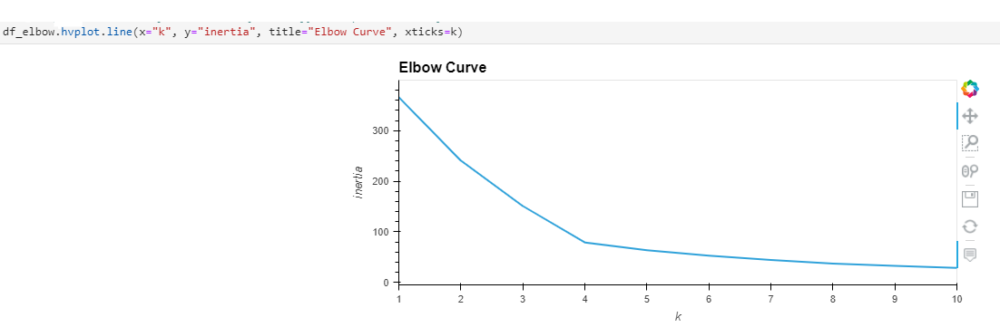

# Module_10_challenge

This file analyzes cryptocurrencies for potential inclusion in a portfolio. The goal is to analyze the assets with a number of different factors to look for performance correlations beyond the usual return an volatility measures. It employs unsupervised learning and PCAs to group the assets for easier analysis.

The analysis begins by accessing a csv file of crypto return percent change data ranging from 1-day to 1-year.

A KMeans model with 4 clusters is initialized and fit to the data, clusters are predicted with the scaled data and added as a column to the existing dataframe.

The assets are then plotted by percent changes in 2-week and 1-year periods, grouped by the predicted clusters.

After these initial observations, the file codes an elbow curve to determine the optimal `k` value, which the plot shows to be `4`.

Next it creates a PCA model instance with 3 components with a total explained variance of 88.46%.

A new model with 5 clusters is then fit to the new PCA dataframe, and columns are added from the initial cluster plot axes, as well as the k4 and k5 clusters. Finally, two plots are created using the same axes as the original, one with 4 clusters, the other with 5.

Based on this analysis, it seems that 4 is the optimal number of clusters to segment the crypto data for portfolio building.